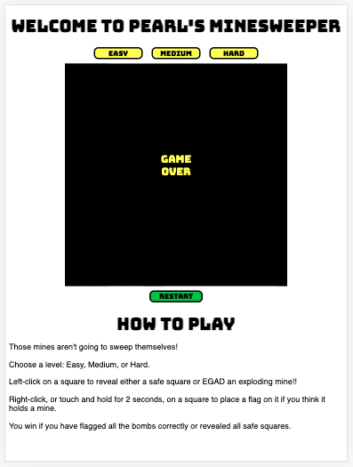

# SEIR-project-1
a browser game

# Pearl's Minesweeper

### Gameplay Screenshots

### Technologies used:
- HTML
- CSS
- JavaScript

### Links
[Minesweeper](https://pwong09.github.io/SEIR-project-1/)  
[Original Wireframe](https://www.figma.com/file/VjNbEEBTZESgVrJ7cGKZr1/Untitled?node-id=0%3A1)  

### Future Enhancements
- give players multiple board size options
- add sound effects for bomb reveal
- add animation for multiple safe square reveals
