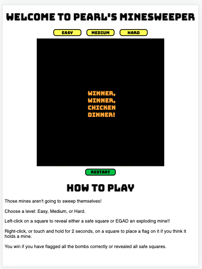

# SEIR-project-1

# Pearl's Minesweeper
A revamped version of the classic logic-based, single-player computer game. The object of the game is to find the randomly placed mines by clicking on "safe" squares. Player can either flag the squares with mines or avoid them entirely. The player gets clues from the safe squares that indicate the number of adjacent mines, if any.  
If a square containing a mine is clicked on, the game ends.  

### Gameplay Screenshots

    
    
    
    
    
    

### Technologies used:
- HTML
- CSS
- JavaScript

### Links
[Minesweeper](https://pwong09.github.io/SEIR-project-1/)  
[Original Wireframe](https://www.figma.com/file/VjNbEEBTZESgVrJ7cGKZr1/Untitled?node-id=0%3A1)  

### Future Enhancements
- add sound effect for bomb reveal
- add animation for multiple safe square reveals
- make rectangular board options
- add a timer